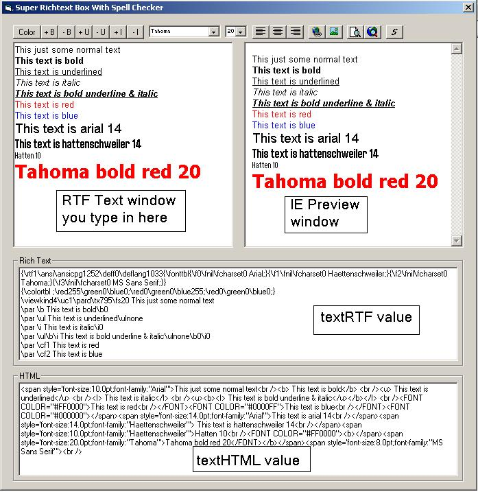



## Extended Richtext Control

### Description

Richtext control with built in spell checker. Also previews the text in IE by converting the richtext to HTML. Has built in formatting, bold, underlined, italic, left/right/center justification plus colors.
 
### More Info
 

             |
---                |---
**Submitted On**   |2007-08-24 20:45:28
**By**             |[Hydro\.H20](https://github.com/Planet-Source-Code/PSCIndex/blob/master/ByAuthor/hydro-h20.md)
**Level**          |Beginner
**User Rating**    |4.8 (29 globes from 6 users)
**Compatibility**  |VB 5\.0, VB 6\.0
**Category**       |[Custom Controls/ Forms/  Menus](https://github.com/Planet-Source-Code/PSCIndex/blob/master/ByCategory/custom-controls-forms-menus__1-4.md)
**World**          |[Visual Basic](https://github.com/Planet-Source-Code/PSCIndex/blob/master/ByWorld/visual-basic.md)
**Archive File**   |[Extended\_R208147912007\.zip](https://github.com/Planet-Source-Code/hydro-h20-extended-richtext-control__1-69236/archive/master.zip)

